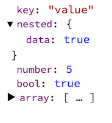

# rd-inspect-object

`rd-inspect-object` is an Angular 1 directive that displays clickable, formatted object graphs, similar to the Web Inspector console.



It can display any scope-available value, per the following:

```html
<rd-inspect-object value="data"></rd-inspect-object>
```

### Running the example

This assumes you have [JSPM](http://jspm.io) installed (`npm install -g jspm`).

- Clone
- `cd rd-inspect-object`
- `npm install`
- `cd example; jspm install; cd ..`
- `gulp serve`
- Browse to [`localhost:8002/example`](http://localhost:8002/example)

### Building

Production-ready files can be rebuilt from source by running `gulp dist`.